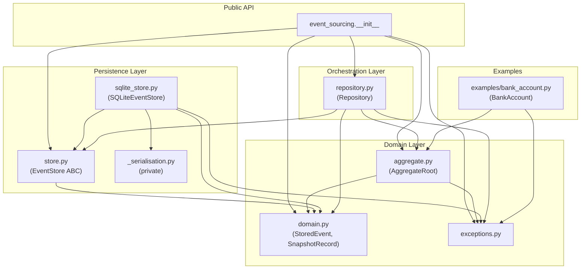

# Design Document: PythonEventSourcingKit

**Project:** PythonEventSourcingKit  
**Version:** 0.1.0-draft  
**Date:** 2026-08-23  
**Status:** Draft — ready for Python Developer agent to implement  
**Satisfies SRS:** `docs/requirements/SRS.md`

---

## Table of Contents

1. [Architecture Overview](#1-architecture-overview)
2. [Package Layout](#2-package-layout)
3. [Module Responsibilities](#3-module-responsibilities)
4. [Key Interfaces](#4-key-interfaces)
5. [SQLite Schema](#5-sqlite-schema)
6. [Rehydration Algorithm](#6-rehydration-algorithm)
7. [Snapshot Strategy](#7-snapshot-strategy)
8. [Concurrency Model](#8-concurrency-model)
9. [Design Decisions & Trade-offs](#9-design-decisions--trade-offs)
10. [Risks](#10-risks)

---

## 1. Architecture Overview

The library is structured around three layers: a **domain layer** (pure in-memory aggregates and value objects), a **persistence layer** (abstract store interface + concrete SQLite implementation), and an **orchestration layer** (the repository that wires the two together).  The `examples` sub-package sits outside this layering intentionally — it is a consumer of the library, not part of it.



**Dependency rule:** nothing in the domain layer or persistence layer imports from `repository`; nothing in the persistence layer imports from the domain layer except through the `domain` and `exceptions` modules.  The `_serialisation` module is only imported by `sqlite_store`.

---

## 2. Package Layout

```
PythonEventSourcingKit/
├── pyproject.toml
├── docs/
│   ├── requirements/
│   │   └── SRS.md
│   └── design/
│       └── DESIGN.md          ← this file
├── src/
│   └── event_sourcing/
│       ├── __init__.py        ← public re-exports only
│       ├── exceptions.py      ← all library-specific exceptions
│       ├── domain.py          ← StoredEvent, SnapshotRecord dataclasses
│       ├── store.py           ← EventStore ABC
│       ├── aggregate.py       ← AggregateRoot base class
│       ├── repository.py      ← Repository class + rehydrate logic
│       ├── sqlite_store.py    ← SQLiteEventStore concrete implementation
│       ├── _serialisation.py  ← JSON helpers (private, leading underscore)
│       └── examples/
│           ├── __init__.py
│           └── bank_account.py  ← BankAccount aggregate + domain events
└── tests/
    ├── conftest.py            ← shared fixtures (in-memory SQLite store)
    ├── test_sqlite_store.py   ← FR-03 – FR-12
    ├── test_aggregate.py      ← FR-13 – FR-17
    ├── test_rehydration.py    ← FR-18, FR-19, FR-24
    └── test_bank_account.py   ← FR-20 – FR-23, FR-24
```

`tests/` mirrors the `src/` layout but does **not** live inside `src/`.  No `__init__.py` is needed in `tests/` because `pytest` uses `rootdir` discovery.

---

## 3. Module Responsibilities

### `exceptions.py`
Owns the entire public exception hierarchy for the library.  Defines `EventSourcingError` (base), `OptimisticConcurrencyError`, `AggregateNotFoundError`, `UnknownEventTypeError`, and `AccountClosedError` / `InsufficientFundsError` (BankAccount domain guards, kept here so they are importable from the top-level package).  Does **not** import any other library module.

### `domain.py`
Owns the two immutable value objects that cross layer boundaries: `StoredEvent` and `SnapshotRecord`.  Both are `dataclass(frozen=True)`.  Does **not** contain any I/O, business logic, or mutable state.

### `store.py`
Owns the `EventStore` abstract base class.  Declares the four abstract operations (`append`, `load`, `save_snapshot`, `load_snapshot`) with full type-hinted signatures.  Does **not** import `sqlite3`, `json`, or any I/O module — it only imports from `domain` and `exceptions`.

### `aggregate.py`
Owns the `AggregateRoot` base class: the `version` counter, the `pending_events` list, the `apply()` dispatcher, the `record()` helper, and the `rehydrate()` classmethod.  Does **not** touch the `EventStore` or any persistence concern — it operates purely in memory on `StoredEvent` value objects handed to it.

### `repository.py`
Owns the `Repository` class, which is the single entry point for orchestrating I/O.  Calls `EventStore` methods, calls `AggregateRoot.rehydrate()`, triggers automatic snapshot saving when the event-count threshold is exceeded, and exposes `rehydrate()` and `save()` to application code.  Does **not** know the SQLite wire format or serialisation details.

### `sqlite_store.py`
Owns the `SQLiteEventStore` concrete class: DDL execution, all SQL queries, transaction management, and translation of `sqlite3.IntegrityError` into `OptimisticConcurrencyError`.  Does **not** contain any domain logic or aggregate knowledge.  Delegates JSON encoding/decoding entirely to `_serialisation`.

### `_serialisation.py`
Owns JSON encoding and decoding of `payload` and `state` dictionaries, including `datetime` ↔ ISO-8601 string conversion.  Private module (leading underscore); only `sqlite_store` imports it.  Does **not** know about `StoredEvent` or any other library type — it operates on plain `dict[str, Any]`.

### `examples/bank_account.py`
Owns the `BankAccount` aggregate and its four domain events (`AccountOpened`, `MoneyDeposited`, `MoneyWithdrawn`, `AccountClosed`).  Imports only from the public `event_sourcing` package.  Does **not** import `sqlite_store` or any persistence module directly — it is a pure consumer of the `AggregateRoot` API.

---

## 4. Key Interfaces

The pseudocode below shows **signatures and contracts only**.  All method bodies are `...`.  `from __future__ import annotations` is assumed throughout.

### 4.1 `StoredEvent` — `domain.py`

```python
from dataclasses import dataclass
from datetime import datetime
from typing import Any

@dataclass(frozen=True)
class StoredEvent:
    aggregate_id: str
    version: int          # per-aggregate monotonically increasing, starts at 1
    event_type: str       # bare class name, e.g. "AccountOpened"
    payload: dict[str, Any]
    occurred_at: datetime  # UTC
```

### 4.2 `SnapshotRecord` — `domain.py`

```python
@dataclass(frozen=True)
class SnapshotRecord:
    aggregate_id: str
    version: int          # aggregate version at snapshot time
    state: dict[str, Any] # full serialisable aggregate state
    taken_at: datetime    # UTC
```

### 4.3 `EventStore` ABC — `store.py`

Design decision: **ABC over Protocol** (see §9.1).

```python
from abc import ABC, abstractmethod
from event_sourcing.domain import StoredEvent, SnapshotRecord

class EventStore(ABC):

    @abstractmethod
    def append(
        self,
        aggregate_id: str,
        events: list[StoredEvent],
        expected_version: int,
    ) -> None:
        """Atomically persist events.

        Raises OptimisticConcurrencyError if the aggregate's current
        highest stored version != expected_version.
        When expected_version == 0 the aggregate must not yet exist.
        """
        ...

    @abstractmethod
    def load(
        self,
        aggregate_id: str,
        after_version: int = 0,
    ) -> list[StoredEvent]:
        """Return events in ascending version order, version > after_version."""
        ...

    @abstractmethod
    def save_snapshot(self, snapshot: SnapshotRecord) -> None:
        """Persist a snapshot; must not alter existing events."""
        ...

    @abstractmethod
    def load_snapshot(self, aggregate_id: str) -> SnapshotRecord | None:
        """Return the highest-version snapshot, or None."""
        ...
```

### 4.4 `AggregateRoot` — `aggregate.py`

**Event-handler convention (resolves OQ-01):** `apply()` looks up a method named `on_<event_type>` on `self` using `getattr`.  The method must accept `dict[str, Any]` as its only argument.  If no handler is found, `UnknownEventTypeError` is raised.  This convention requires no metaclass, decorator, or registry — it is discoverable by reading the class definition.

**Version invariant:** `version` always equals the number of events that have been passed through `apply()` since the aggregate was constructed.  Application code must **only** raise new events via `record()`; calling `apply()` directly outside of `record()` and `rehydrate()` breaks this invariant.

```python
from datetime import datetime, timezone
from typing import Any, Self
from event_sourcing.domain import StoredEvent, SnapshotRecord

class AggregateRoot:
    aggregate_id: str
    version: int                      # incremented by apply(); 0 = new aggregate
    _pending_events: list[StoredEvent]

    def __init__(self, aggregate_id: str) -> None: ...

    # ── public read API ──────────────────────────────────────────────────────

    @property
    def pending_events(self) -> list[StoredEvent]:
        """Uncommitted events raised since last load or clear."""
        ...

    def clear_pending_events(self) -> None:
        """Called by Repository.save() after a successful append."""
        ...

    # ── event lifecycle ──────────────────────────────────────────────────────

    def apply(self, event: StoredEvent) -> None:
        """Dispatch to on_<event.event_type>(payload) and increment version.

        Used internally by record() and rehydrate(). Not intended for
        direct call by application code after construction.
        """
        ...

    def record(self, event_type: str, payload: dict[str, Any]) -> None:
        """Create a StoredEvent, apply it, and add it to pending_events.

        Domain methods on concrete subclasses call this to raise events.
        """
        ...

    # ── snapshot hooks ───────────────────────────────────────────────────────

    def snapshot_state(self) -> dict[str, Any]:
        """Return a serialisable dict of the full aggregate state.

        Concrete subclasses must override this if they participate in
        snapshot-based rehydration.
        """
        ...

    def _restore_from_snapshot(self, state: dict[str, Any]) -> None:
        """Apply snapshot state to self; called only by rehydrate().

        Concrete subclasses must override this to restore their fields.
        """
        ...

    # ── rehydration ──────────────────────────────────────────────────────────

    @classmethod
    def rehydrate(
        cls,
        aggregate_id: str,
        events: list[StoredEvent],
        snapshot: SnapshotRecord | None = None,
    ) -> Self:
        """Reconstruct an aggregate instance from a snapshot and/or events.

        Does NOT touch the EventStore. The Repository is responsible for
        fetching snapshot and events before calling this.
        Returned instance always has empty pending_events.
        """
        ...
```

### 4.5 `Repository` — `repository.py`

```python
from typing import TypeVar
from event_sourcing.store import EventStore
from event_sourcing.aggregate import AggregateRoot

AggregateT = TypeVar("AggregateT", bound=AggregateRoot)

class Repository:

    def __init__(
        self,
        store: EventStore,
        snapshot_threshold: int = 50,
    ) -> None:
        """
        snapshot_threshold: auto-save a new snapshot after this many events
        have been replayed since the last snapshot (or since the start if none).
        """
        ...

    def rehydrate(
        self,
        aggregate_class: type[AggregateT],
        aggregate_id: str,
    ) -> AggregateT:
        """Load snapshot + events, rehydrate the aggregate, trigger snapshot
        if threshold is exceeded.

        Raises AggregateNotFoundError if no snapshot and no events exist.
        """
        ...

    def save(self, aggregate: AggregateRoot) -> None:
        """Append pending_events to the store and clear them on success.

        expected_version is derived as aggregate.version - len(pending_events).
        Raises OptimisticConcurrencyError (propagated from EventStore.append).
        """
        ...
```

### 4.6 `SQLiteEventStore` — `sqlite_store.py`

```python
import sqlite3
from event_sourcing.store import EventStore
from event_sourcing.domain import StoredEvent, SnapshotRecord

class SQLiteEventStore(EventStore):

    def __init__(self, db_path: str) -> None:
        """Open (or create) the SQLite database and run DDL."""
        ...

    def append(
        self,
        aggregate_id: str,
        events: list[StoredEvent],
        expected_version: int,
    ) -> None:
        """See EventStore.append.

        Implementation: within a single transaction, SELECT MAX(version)
        for the aggregate; if it does not match expected_version, ROLLBACK
        and raise OptimisticConcurrencyError; otherwise INSERT all events.
        """
        ...

    def load(
        self,
        aggregate_id: str,
        after_version: int = 0,
    ) -> list[StoredEvent]:
        ...

    def save_snapshot(self, snapshot: SnapshotRecord) -> None:
        ...

    def load_snapshot(self, aggregate_id: str) -> SnapshotRecord | None:
        ...

    def close(self) -> None:
        """Close the underlying sqlite3.Connection."""
        ...
```

`SQLiteEventStore` implements the context-manager protocol (`__enter__` / `__exit__`) so it can be used in a `with` block; `__exit__` calls `close()`.

### 4.7 `BankAccount` — `examples/bank_account.py`

```python
from decimal import Decimal
from typing import Any
from event_sourcing.aggregate import AggregateRoot

class BankAccount(AggregateRoot):
    owner: str
    balance: Decimal
    is_closed: bool

    # ── factory ──────────────────────────────────────────────────────────────

    @classmethod
    def open_account(cls, owner: str, initial_balance: Decimal) -> "BankAccount":
        """Generate a UUID aggregate_id, record AccountOpened, return instance."""
        ...

    # ── domain operations ────────────────────────────────────────────────────

    def deposit(self, amount: Decimal) -> None:
        """Raises AccountClosedError if closed; records MoneyDeposited."""
        ...

    def withdraw(self, amount: Decimal) -> None:
        """Raises AccountClosedError if closed.
        Raises InsufficientFundsError if amount > balance.
        Records MoneyWithdrawn.
        """
        ...

    def close_account(self) -> None:
        """Raises AccountClosedError if already closed; records AccountClosed."""
        ...

    # ── event handlers (on_<EventType> convention) ───────────────────────────

    def on_AccountOpened(self, payload: dict[str, Any]) -> None: ...
    def on_MoneyDeposited(self, payload: dict[str, Any]) -> None: ...
    def on_MoneyWithdrawn(self, payload: dict[str, Any]) -> None: ...
    def on_AccountClosed(self, payload: dict[str, Any]) -> None: ...

    # ── snapshot support ─────────────────────────────────────────────────────

    def snapshot_state(self) -> dict[str, Any]:
        """Return {"owner": ..., "balance": str(self.balance), "is_closed": ...}"""
        ...

    def _restore_from_snapshot(self, state: dict[str, Any]) -> None:
        """Restore owner, balance (via Decimal), is_closed from snapshot state."""
        ...
```

**BankAccount event payloads:**

| Event | Payload keys |
|-------|-------------|
| `AccountOpened` | `owner: str`, `initial_balance: str` (Decimal serialised as string) |
| `MoneyDeposited` | `amount: str` |
| `MoneyWithdrawn` | `amount: str` |
| `AccountClosed` | *(empty dict)* |

`Decimal` values are serialised as strings to avoid floating-point rounding in JSON.

### 4.8 Exception Hierarchy — `exceptions.py`

```python
class EventSourcingError(Exception): ...

class OptimisticConcurrencyError(EventSourcingError):
    def __init__(self, aggregate_id: str, expected: int, actual: int | None) -> None: ...

class AggregateNotFoundError(EventSourcingError):
    def __init__(self, aggregate_id: str) -> None: ...

class UnknownEventTypeError(EventSourcingError):
    def __init__(self, event_type: str) -> None: ...

# BankAccount domain guards — in exceptions.py so they are importable from
# the top-level package without importing the examples sub-package.
class InsufficientFundsError(EventSourcingError):
    def __init__(self, aggregate_id: str, balance: object, amount: object) -> None: ...

class AccountClosedError(EventSourcingError):
    def __init__(self, aggregate_id: str) -> None: ...
```

### 4.9 Public API surface — `__init__.py`

The following names shall be importable directly from `event_sourcing`:

```python
from event_sourcing.domain import StoredEvent, SnapshotRecord
from event_sourcing.store import EventStore
from event_sourcing.aggregate import AggregateRoot
from event_sourcing.repository import Repository
from event_sourcing.sqlite_store import SQLiteEventStore
from event_sourcing.exceptions import (
    EventSourcingError,
    OptimisticConcurrencyError,
    AggregateNotFoundError,
    UnknownEventTypeError,
    InsufficientFundsError,
    AccountClosedError,
)

__all__ = [
    "StoredEvent",
    "SnapshotRecord",
    "EventStore",
    "AggregateRoot",
    "Repository",
    "SQLiteEventStore",
    "EventSourcingError",
    "OptimisticConcurrencyError",
    "AggregateNotFoundError",
    "UnknownEventTypeError",
    "InsufficientFundsError",
    "AccountClosedError",
]
```

---

## 5. SQLite Schema

Both tables are created by `SQLiteEventStore.__init__` using `CREATE TABLE IF NOT EXISTS`.  The database file is opened with `check_same_thread=False` (single-process use; NFR-07 explicitly restricts to single-writer).

```sql
CREATE TABLE IF NOT EXISTS events (
    id            INTEGER  PRIMARY KEY AUTOINCREMENT,
    aggregate_id  TEXT     NOT NULL,
    version       INTEGER  NOT NULL,
    event_type    TEXT     NOT NULL,
    payload       TEXT     NOT NULL,   -- JSON object; OQ-04 resolved: TEXT for debuggability
    occurred_at   TEXT     NOT NULL,   -- ISO-8601 UTC, e.g. "2026-08-23T10:00:00+00:00"
    UNIQUE (aggregate_id, version)     -- enforces optimistic-lock uniqueness
);

CREATE TABLE IF NOT EXISTS snapshots (
    id            INTEGER  PRIMARY KEY AUTOINCREMENT,
    aggregate_id  TEXT     NOT NULL,
    version       INTEGER  NOT NULL,
    state         TEXT     NOT NULL,   -- JSON object
    taken_at      TEXT     NOT NULL,   -- ISO-8601 UTC
    UNIQUE (aggregate_id, version)
);
```

**Index rationale:** the `UNIQUE (aggregate_id, version)` constraint on `events` serves a dual purpose: it is the uniqueness guard for the optimistic-concurrency check (a concurrent writer inserting the same version gets an `IntegrityError`) and implicitly creates a B-tree index that makes `load()` queries efficient for the common case of scanning a single aggregate's events.

`aggregate_id` is typed as `TEXT` to allow any string-format identifier (resolves OQ-05); the `BankAccount` example uses UUID4 strings.

---

## 6. Rehydration Algorithm

Implemented in `Repository.rehydrate(aggregate_class, aggregate_id)`:

1. Call `self._store.load_snapshot(aggregate_id)` → `snapshot: SnapshotRecord | None`.
2. Determine `after_version = snapshot.version if snapshot is not None else 0`.
3. Call `self._store.load(aggregate_id, after_version=after_version)` → `events: list[StoredEvent]`.
4. If `snapshot is None` and `len(events) == 0`, raise `AggregateNotFoundError(aggregate_id)`.
5. Call `aggregate_class.rehydrate(aggregate_id, events, snapshot)` → `aggregate` (in-memory reconstruction):
   a. Instantiate a blank aggregate via `AggregateRoot.__init__(aggregate_id)`.
   b. If `snapshot is not None`: call `instance._restore_from_snapshot(snapshot.state)` then set `instance.version = snapshot.version`.
   c. For each `event` in `events` (already in ascending version order): call `instance.apply(event)`.
   d. Call `instance.clear_pending_events()` (applied events are committed history, not pending).
   e. Return `instance`.
6. Compute `events_since_snapshot = len(events)`.  If `events_since_snapshot >= self._snapshot_threshold`, call `self._store.save_snapshot(SnapshotRecord(aggregate_id, aggregate.version, aggregate.snapshot_state(), datetime.now(UTC)))`.
7. Return `aggregate`.

---

## 7. Snapshot Strategy

**Trigger (resolves OQ-02):** Automatic, managed by `Repository`.  After every successful `rehydrate()` call, the repository counts how many events were replayed since the last snapshot (or from version 0 if none).  If that count is ≥ `snapshot_threshold` (default `50`), a new snapshot is saved immediately.  Application code can also call `store.save_snapshot()` directly for manual snapshots; the two approaches are compatible.

**Hybrid replay approach:** When rehydrating, `load()` is called with `after_version=snapshot.version` so only events newer than the snapshot are fetched and applied.  This bounds replay cost to at most `snapshot_threshold` events under steady-state operation.

**Snapshot immutability:** `save_snapshot` inserts a new row rather than overwriting; multiple snapshots for the same aggregate can coexist.  `load_snapshot` returns the row with the highest `version`.  Old snapshot rows are never deleted by this library (out of scope for this version).

---

## 8. Concurrency Model

**Optimistic locking via `expected_version` (FR-05, FR-06).**

The `SQLiteEventStore.append()` implementation runs the following logic atomically inside a single SQLite transaction:

```sql
-- Step 1: read current maximum version (None means aggregate does not exist)
SELECT MAX(version) FROM events WHERE aggregate_id = ?;

-- Step 2: if result != expected_version → ROLLBACK → raise OptimisticConcurrencyError

-- Step 3: INSERT each new event in order
INSERT INTO events (aggregate_id, version, event_type, payload, occurred_at)
VALUES (?, ?, ?, ?, ?);

-- Step 4: COMMIT
```

Because SQLite serialises all writes (WAL mode is the default for concurrency within a single process), the `SELECT … INSERT` sequence is effectively atomic when the connection is in `autocommit=False` (the default for the `sqlite3` module with explicit `BEGIN`).

The `UNIQUE (aggregate_id, version)` constraint provides a secondary safety net: if two writers (in the same process via two `SQLiteEventStore` instances sharing a file) both pass the version check and race to insert, only one INSERT will succeed; the second will receive a `sqlite3.IntegrityError` which is caught and re-raised as `OptimisticConcurrencyError`.

**NFR-07:** Multi-process write concurrency is explicitly out of scope.  SQLite's file-level locking prevents data corruption but does not provide the retry semantics that a real multi-writer system would need.

---

## 9. Design Decisions & Trade-offs

### 9.1 ABC vs. Protocol for `EventStore` (OQ-03)

**Decision:** `ABC`.

`Protocol` allows structural subtyping (duck typing) — any class with matching methods satisfies the interface without inheriting from it.  `ABC` requires explicit inheritance.

For this portfolio library, `ABC` is preferred because:
- It makes the contract **explicit and visible** in the class hierarchy — reviewers can immediately see what `SQLiteEventStore` commits to.
- `@abstractmethod` gives a clear, standard `TypeError` at instantiation time if a method is forgotten, rather than a type-checker-only error.
- The library is designed for extension (a future `PostgreSQLEventStore` is the documented upgrade path); explicit inheritance signals that intent.

The trade-off is that third-party stores must import and inherit from `EventStore`; they cannot be duck-typed.  Given the library's explicit purpose as an extension point (SRS §4), this is acceptable.

### 9.2 `on_<ClassName>` dispatch convention (OQ-01)

**Decision:** method-naming convention (`on_AccountOpened`, etc.).

A decorator-based registry (e.g., `@handles(AccountOpened)`) is more explicit but requires a metaclass or class-level `__init_subclass__` hook to build the registry, adding ~30 lines of infrastructure code for no gain in this single-aggregate example.

The `getattr(self, f"on_{event.event_type}", None)` lookup is transparent, zero-dependency, and immediately understandable.  The trade-off is that handler names are stringly-typed; a typo produces an `UnknownEventTypeError` at runtime rather than a static analysis error.  `mypy --strict` will not catch a missing `on_X` method, but the test suite's rehydration tests will.

### 9.3 Automatic vs. manual snapshots (OQ-02)

**Decision:** automatic threshold-based trigger in `Repository`, configurable, default 50.

Manual snapshots keep the library API smaller, but leave every consumer to re-implement the "every N events" logic.  The `snapshot_threshold` parameter makes the policy explicit and testable without hiding it in library internals.  Application code can still override by calling `store.save_snapshot()` directly.

### 9.4 SQLite today, PostgreSQL tomorrow

This library ships with SQLite as the only backend, appropriate for a zero-infrastructure portfolio project.  The `EventStore` ABC is the designed seam for substitution.  Migrating to PostgreSQL would require:
1. Writing a `PostgreSQLEventStore(EventStore)` in a new module (e.g., `pg_store.py`).
2. Changing `Repository.__init__` to accept the new store instance.
3. No changes to `AggregateRoot`, domain objects, or application code.

The `UNIQUE (aggregate_id, version)` constraint maps directly to a PostgreSQL unique index.  The optimistic-concurrency `SELECT … INSERT` pattern maps directly to a PostgreSQL transaction with `READ COMMITTED` isolation.  For higher concurrency, `SELECT … FOR UPDATE` on the version row would replace the `MAX(version)` check.

---

## 10. Risks

| # | Risk | Likelihood | Impact | Mitigation |
|---|------|-----------|--------|------------|
| R-01 | `BankAccount.snapshot_state` / `_restore_from_snapshot` contract is subtle; easy to omit a field and cause silent data loss | Medium | High | Test: snapshot a BankAccount, rehydrate from snapshot only (no events), assert all fields match |
| R-02 | `clear_pending_events()` not called after `rehydrate()` means the returned aggregate "remembers" applied events as pending | Medium | High | `AggregateRoot.rehydrate()` classmethod calls `clear_pending_events()` unconditionally (step 5d of algorithm) |
| R-03 | `Decimal` serialised as `str` — reading back a snapshot on a platform with different locale or precision settings could mismatch | Low | Medium | Use `decimal.Decimal(str_value)` canonically; add a round-trip test |
| R-04 | SQLite in-process WAL concurrency: two `SQLiteEventStore` objects pointing at the same file in the same test process will share the WAL but not the Python-level transaction state | Low | Medium | Test fixtures must use a single store instance per test; `conftest.py` documents this |
| R-05 | `mypy --strict` will flag `TypeVar`-bound `AggregateT` return from `Repository.rehydrate` if the bound is not propagated correctly | Low | Low | Use `type[AggregateT]` parameter and `-> AggregateT` return; covered by NFR-03 |

---

*Design is ready for the Python Developer agent to implement.*
